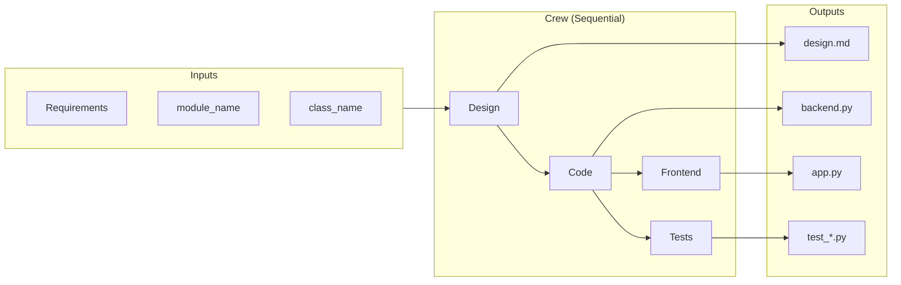

# Engineering Team

> An AI-powered engineering crew that turns natural language requirements into a designed backend module, implementation, Gradio UI, and unit tests — built with [CrewAI](https://crewai.com/).

---

## Summary

**AI Crew Engineering Team** is a multi-agent pipeline that automates software development from requirements to delivery. You provide high-level requirements (what the system should do), a target module name, and a class name. The crew designs the solution, implements it in Python, builds a Gradio demo UI, and writes unit tests — all in one run.

The pipeline uses **CrewAI** with four specialized agents that collaborate sequentially. Code execution runs inside **Docker** for safety and isolation.

---

## Objective

- **Automate** the design → code → UI → tests workflow for self-contained Python modules  
- **Reduce** manual work for prototyping and demos  
- **Showcase** CrewAI multi-agent orchestration with sequential tasks and context passing  
- **Produce** runnable outputs: a backend module, Gradio `app.py`, and tests under a single `output/` directory  

---

## High-Level Architecture



| Step | Agent | Output |
|------|-------|--------|
| 1 | Engineering Lead | Design doc (Markdown) |
| 2 | Backend Engineer | Python backend module |
| 3 | Frontend Engineer | Gradio `app.py` |
| 4 | Test Engineer | Unit tests |

---

## CrewAI Basics

- **Agents** — LLM-powered roles (e.g. Engineering Lead, Backend Engineer) with a role, goal, and backstory.  
- **Tasks** — Work items assigned to agents; each task has a description, expected output, and optional context from earlier tasks.  
- **Crew** — A group of agents and tasks orchestrated by a process (here: `sequential`).  
- **Context chain** — Later tasks receive earlier task outputs (e.g. design → code; code → frontend & tests).

The crew is configured in `config/agents.yaml` and `config/tasks.yaml`, and assembled in `crew.py`.

---

## Code Execution in Docker

The **Backend Engineer** and **Test Engineer** agents use CrewAI’s **Code Interpreter** to write and run Python code. For safety:

- Code runs in **Docker** (`code_execution_mode="safe"`).  
- Execution is sandboxed; time and retries are limited (e.g. 500s timeout, 3 retries).

**Requirement:** [Docker](https://www.docker.com/products/docker-desktop/) must be installed and running. On macOS with Docker Desktop, the project sets `DOCKER_HOST` automatically when needed.

---

## Quick Start

### Prerequisites

- Python 3.10–3.12  
- [uv](https://docs.astral.sh/uv/) (or `pip`)  
- [Docker Desktop](https://www.docker.com/products/docker-desktop/) (for code execution)  
- API keys for LLMs (e.g. `OPENAI_API_KEY` in `.env`)

### Run the crew

```bash
cd src/engineering_team
crewai install
crewai run
```

Or with uv:

```bash
cd src/engineering_team
uv sync && uv run engineering_team
```

### Customize inputs

Edit `src/engineering_team/src/engineering_team/main.py` to change:

- `requirements` — Natural language description of the system  
- `module_name` — Target module file (e.g. `accounts.py`)  
- `class_name` — Main class name (e.g. `Account`)

### Outputs

Generated files appear under `src/engineering_team/output/`:

| File | Description |
|------|-------------|
| `{module}_design.md` | Design document |
| `{module_name}` | Backend Python module |
| `app.py` | Gradio demo UI |
| `test_{module_name}` | Unit tests |

Run the app:

```bash
cd src/engineering_team/output && python app.py
```

Run tests:

```bash
cd src/engineering_team/output && python -m pytest test_accounts.py -v
```

---

## Project Structure

```
ai-crew-engineering-team/
├── src/engineering_team/
│   ├── src/engineering_team/
│   │   ├── config/           # agents.yaml, tasks.yaml
│   │   ├── crew.py           # Crew definition
│   │   └── main.py           # Entry point & inputs
│   └── output/               # Generated design, module, app, tests
└── docs/
    ├── architecture.md       # Detailed architecture & diagrams
    └── developers_guide.md   # Implementation & extension guide
```

---

## Documentation

- [Demo](docs/demo.md) — How to run the code, console output walkthrough, and pipeline flow  
- [Architecture](docs/architecture.md) — Flow diagrams, pipelines, and run options  
- [Developers Guide](docs/developers_guide.md) — How to modify agents, tasks, and extend the crew  

---

## Related CrewAI Projects

| Project | Description | Link |
|--------|-------------|------|
| **ai-crew-financial-researcher** | Two-agent pipeline: a Researcher gathers company data via web search, and an Analyst synthesizes it into a markdown report. Uses Serper for real-time financial data. | [GitHub](https://github.com/aditya-caltechie/ai-crew-financial-researcher) |
| **ai-crew-stock-picker** | Hierarchical multi-agent system: a Manager delegates to worker agents that find trending companies, research each, and recommend the best investment. Uses Serper, Pushover, RAG + SQLite, and Pydantic. | [GitHub](https://github.com/aditya-caltechie/ai-crew-stock-picker) |

### ai-crew-financial-researcher

A multi-agent application that performs financial research and reporting on companies. The **Researcher** agent uses web search (SerperDevTool) to gather status, performance, news, and outlook; the **Analyst** agent receives that context and writes a polished markdown report. Sequential flow, config-driven, supports multiple LLMs (e.g. OpenAI for research, Groq for analysis).

### ai-crew-stock-picker

StockPicker uses a **hierarchical process**: a Manager agent delegates tasks to worker agents. It finds 2–3 trending companies in a sector, researches each in depth, picks the best one, and optionally sends a push notification. Features include Pydantic for structured outputs, RAG + SQLite for memory, Serper for search, and Pushover for notifications.

---

## Comparison: All Three CrewAI Projects

| Aspect | ai-crew-financial-researcher | ai-crew-stock-picker | ai-crew-engineering-team *(this project)* |
|--------|------------------------------|----------------------|-------------------------------------------|
| **Process** | Sequential (2 tasks) | Hierarchical (Manager → workers) | Sequential (4 tasks) |
| **Agents** | 2 (Researcher, Analyst) | Manager + worker agents | 4 (Engineering Lead, Backend, Frontend, Test Engineer) |
| **Input** | Company name | Sector, date | Natural language requirements, module name, class name |
| **Output** | Markdown report | Best stock pick, push notification | Design doc, Python backend, Gradio UI, unit tests |
| **Tools** | SerperDevTool (web search) | Serper, Pushover, RAG + SQLite | Code Interpreter (Docker) |
| **External APIs** | Serper | Serper, Pushover | None (code-only) |
| **Code execution** | No | No | Yes (Docker sandbox) |
| **Use case** | Research & reporting | Investment recommendation | Automated software development |

**Pipeline summary**

- **Financial Researcher** — Search → Research document → Report. Good for learning sequential flows and web search integration.
- **Stock Picker** — Manager delegates: find trending → research each → pick best. Demonstrates hierarchical orchestration, memory, and notifications.
- **Engineering Team** — Design → Code → UI → Tests. Automates the full software development lifecycle with code generation and execution.

---

## License

See repository for license details.
