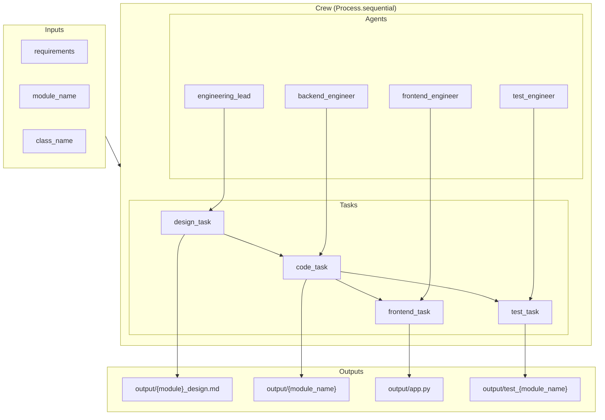
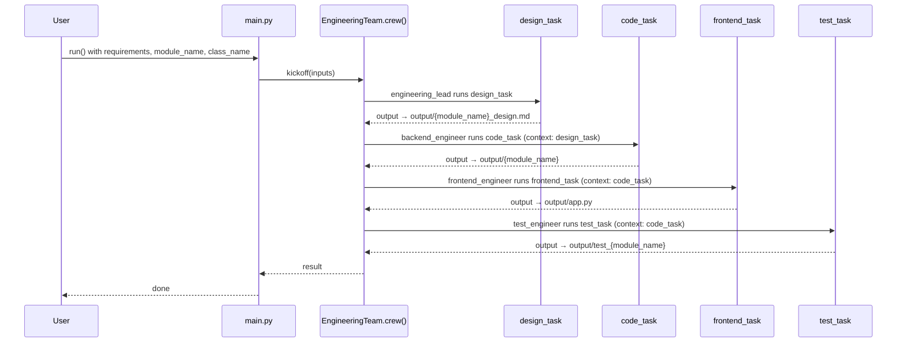
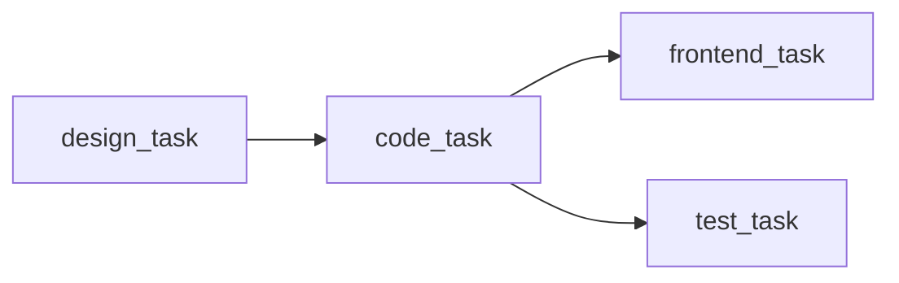

# Architecture

This document describes the architecture, flow, and usage of the **AI Crew Engineering Team** — a CrewAI-based pipeline that turns high-level requirements into a designed backend module, implementation, Gradio UI, and unit tests.

---

## 1. Architecture diagram



**High-level view**

| Layer | Role |
|-------|------|
| **Inputs** | User-defined requirements, target module name, and class name. |
| **Crew** | Single Crew with 4 agents and 4 tasks, executed in sequence. |
| **Agents** | Engineering Lead, Backend Engineer, Frontend Engineer, Test Engineer (each has an LLM and optional code execution). |
| **Outputs** | Design doc (Markdown), backend module, Gradio `app.py`, and test module under `output/`. |

---

## 2. Flow diagram



**Task dependency flow**



- **design_task** has no context dependency; it uses only the kickoff `inputs`.
- **code_task** receives **design_task** output as context.
- **frontend_task** and **test_task** both receive **code_task** output as context (they run after code_task in the same sequential order).

---

## 3. How the code works

### 3.1 Entry point and inputs

- **Entry:** `src/engineering_team/src/engineering_team/main.py`
- **Behavior:**
  - Sets `DOCKER_HOST` for Docker Desktop on macOS if needed.
  - Creates `output/` if missing.
  - Defines `requirements`, `module_name`, and `class_name` (currently for an account/trading simulation).
  - Calls `EngineeringTeam().crew().kickoff(inputs={...})`.

Inputs passed to the crew:

- `requirements` — Natural language specification of the system (e.g. account management, deposits, withdrawals, share buy/sell, portfolio value, constraints).
- `module_name` — Target Python module name (e.g. `accounts.py`).
- `class_name` — Main class name in that module (e.g. `Account`).

### 3.2 Crew definition (`crew.py`)

- **CrewBase:** `EngineeringTeam` in `src/engineering_team/src/engineering_team/crew.py`.
- **Config:** Agents from `config/agents.yaml`, tasks from `config/tasks.yaml`.
- **Process:** `Process.sequential` — tasks run one after another.
- **Agents (4):**
  - **engineering_lead** — Produces the design doc (no code execution).
  - **backend_engineer** — Implements the module; has **code execution** (Docker, safe mode, 500s timeout, 3 retries).
  - **frontend_engineer** — Writes Gradio `app.py` (no code execution in config).
  - **test_engineer** — Writes unit tests; has **code execution** (same Docker/safe settings).

Agents use placeholders from `inputs` (e.g. `{requirements}`, `{module_name}`, `{class_name}`) as defined in `agents.yaml`.

### 3.3 Tasks (`config/tasks.yaml`)

| Task | Agent | Context | Output file |
|------|--------|---------|-------------|
| design_task | engineering_lead | — | `output/{module_name}_design.md` |
| code_task | backend_engineer | design_task | `output/{module_name}` |
| frontend_task | frontend_engineer | code_task | `output/app.py` |
| test_task | test_engineer | code_task | `output/test_{module_name}` |

- **design_task:** Markdown design (classes, methods, constraints).
- **code_task:** Single self-contained Python module implementing the design.
- **frontend_task:** Single-file Gradio app that imports and demos the backend class.
- **test_task:** Single-file test module (e.g. `test_accounts.py`) for the backend.

Outputs are written under the project’s `output/` directory (e.g. when running from `src/engineering_team`, that’s `src/engineering_team/output/`).

### 3.4 Config files

- **`config/agents.yaml`** — Role, goal, backstory, and LLM per agent (e.g. `gpt-4o` for lead, `openai/gpt-4o-mini` for others). Optional commented alternatives (e.g. Groq).
- **`config/tasks.yaml`** — Description, expected_output, agent, context, and `output_file` per task.

### 3.5 Custom tool (optional)

- **`tools/custom_tool.py`** — Example CrewAI tool (e.g. `MyCustomTool`). Not required for the default pipeline; agents can be extended to use it if needed.

---

## 4. Important pipelines and concepts

| Concept | Description |
|--------|-------------|
| **Sequential pipeline** | Design → Code → Frontend → Test. Order is fixed; later tasks rely on earlier outputs via `context`. |
| **Context chain** | design_task output → code_task; code_task output → frontend_task and test_task. Ensures frontend and tests align with the implemented module. |
| **Single-module backend** | Requirements and design are scoped to one Python module and one main class, keeping the pipeline simple and deterministic. |
| **Safe code execution** | Backend and test agents run code in Docker (`code_execution_mode="safe"`) with time and retry limits. |
| **Output layout** | All artifacts go under `output/`: design doc, backend module, `app.py`, and test module, so you can run and test in one place. |

---

## 5. How to run

### 5.1 Prerequisites

- Python 3.10–3.12 (per `engineering_team` package).
- [CrewAI](https://docs.crewai.com/) dependencies (installed with the `engineering_team` package).
- For agents that use code execution: Docker (for safe code run).
- API keys for the LLMs used in `config/agents.yaml` (e.g. OpenAI) in your environment or `.env`.

### 5.2 Recommended: from the engineering_team package

The crew and entry point live in `src/engineering_team`. Run from that directory:

```bash
cd src/engineering_team
crewai install
crewai run
```

Or with uv:

```bash
cd src/engineering_team
uv sync
uv run engineering_team  # or: uv run run_crew
```

### 5.3 From repo root

```bash
cd src/engineering_team && crewai install && crewai run
```

Or with uv:

```bash
uv sync
cd src/engineering_team && uv run engineering_team
```

### 5.4 Environment

- Put OpenAI (or other provider) keys in `.env` or the environment so CrewAI/LLM clients can access them.
- Example (if using OpenAI): `OPENAI_API_KEY=sk-...`

### 5.5 After a run

- **Design:** `output/<module_name>_design.md`
- **Backend:** `output/<module_name>` (e.g. `output/accounts.py`)
- **UI:** `output/app.py`
- **Tests:** `output/test_<module_name>` (e.g. `output/test_accounts.py`)

Run the app (from the directory that contains `output/` and the backend module):

```bash
cd output && python app.py
```

Run tests:

```bash
cd output && python -m pytest test_accounts.py -v
# or
cd output && python -m unittest test_accounts
```

---

## 6. Directory layout (relevant to architecture)

```
ai-crew-engineering-team/
├── docs/
│   └── architecture.md          # This file
├── src/
│   └── engineering_team/
│       ├── src/
│       │   └── engineering_team/
│       │       ├── config/
│       │       │   ├── agents.yaml
│       │       │   └── tasks.yaml
│       │       ├── tools/
│       │       │   └── custom_tool.py
│       │       ├── crew.py       # Crew + agents + tasks
│       │       └── main.py       # Entry, inputs, kickoff
│       ├── output/               # Generated design, module, app, tests
│       └── pyproject.toml        # Scripts: engineering_team, run_crew, etc.
├── pyproject.toml                # Workspace/root deps
└── README.md
```

This layout keeps the crew definition, config, and tools inside `src/engineering_team`, with all pipeline outputs under `output/`.
