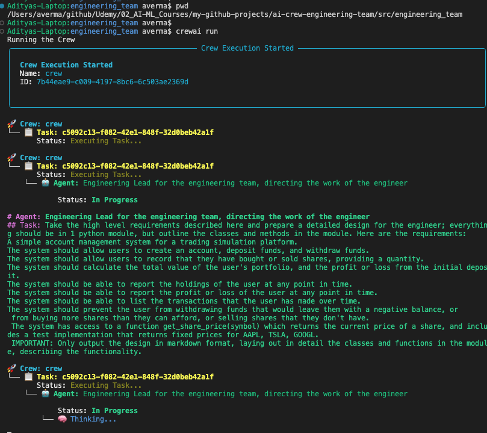
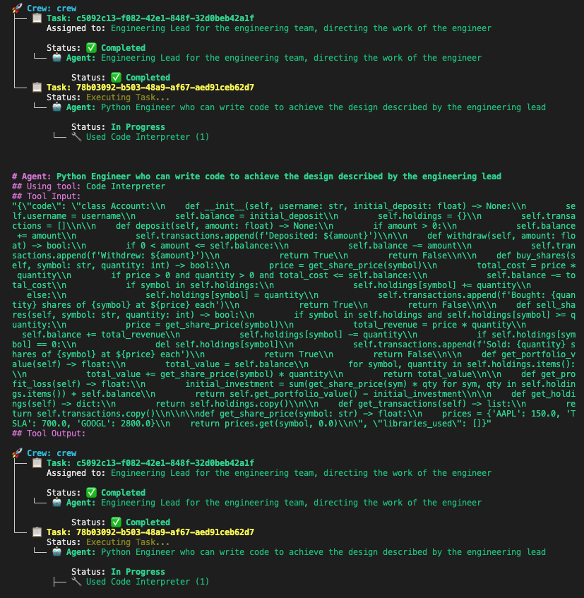
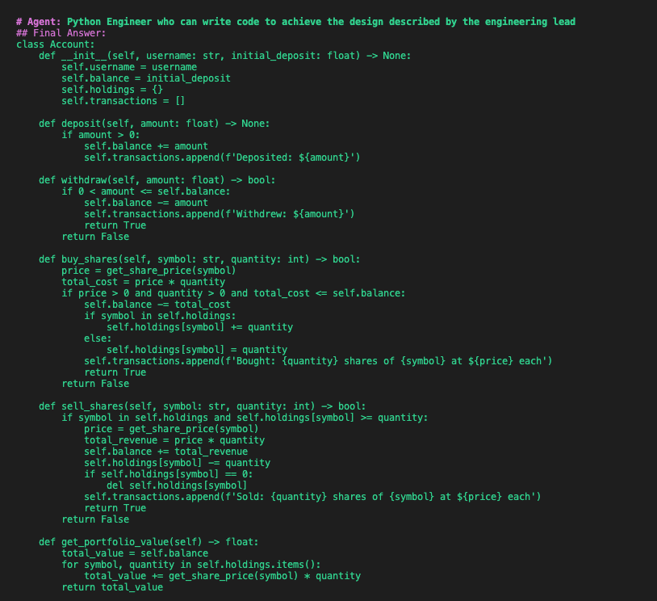
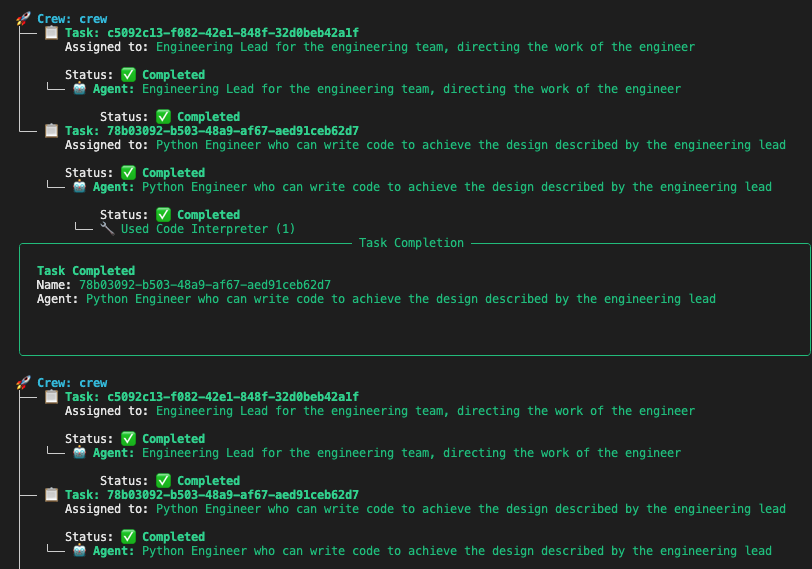
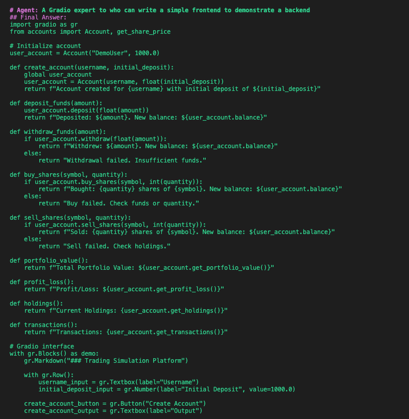
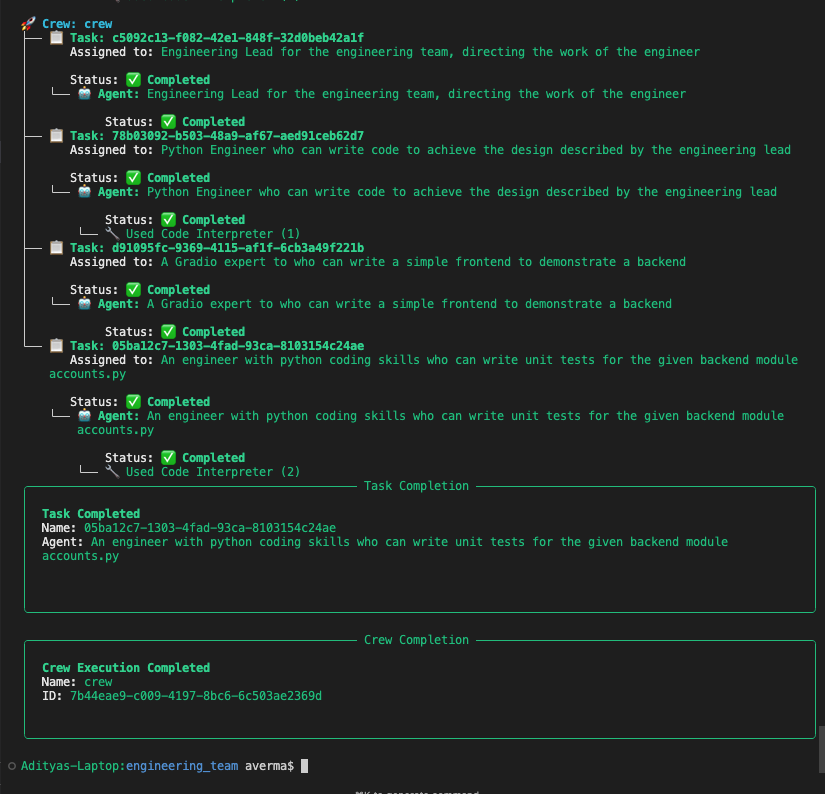
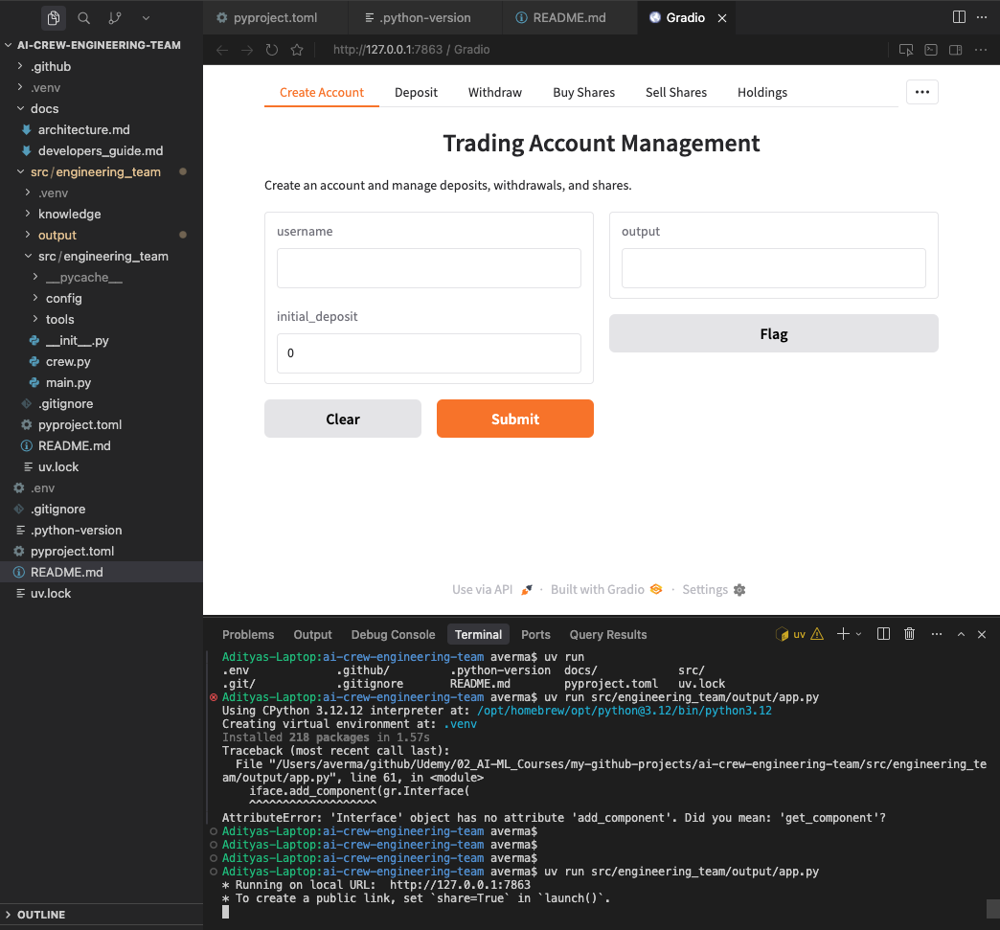

# Demo: Running the AI Crew Engineering Team

This guide walks you through how to run the AI Crew pipeline, what happens at each stage, and how to use the generated application. It includes console output screenshots and maps the flow to the underlying code.

---

## How to Run the Code

### Prerequisites

- Python 3.10–3.12
- [uv](https://docs.astral.sh/uv/) (or pip)
- [Docker Desktop](https://www.docker.com/products/docker-desktop/) (for agent code execution)
- API keys (e.g. `OPENAI_API_KEY`) in `.env`

### Run the Crew

```bash
cd src/engineering_team
crewai install
crewai run
```

Or with uv:

```bash
cd src/engineering_team
uv sync && uv run engineering_team
```

### Run the Generated App

After the crew completes, the outputs are written to `src/engineering_team/output/`. To run the Gradio app:

```bash
cd src/engineering_team/output
uv run app.py
```

Or from the project root:

```bash
uv run src/engineering_team/output/app.py
```

The app runs at `http://127.0.0.1:7863` (or another port if that one is busy).

---

## Pipeline as per Code

The flow is driven by `src/engineering_team/src/engineering_team/main.py` and `crew.py`.

### Entry Point (`main.py`)

`main.py` sets the inputs and kicks off the crew:

```python
requirements = """
A simple account management system for a trading simulation platform.
...
"""
module_name = "accounts.py"
class_name = "Account"

# Create and run the crew
result = EngineeringTeam().crew().kickoff(inputs={
    'requirements': requirements,
    'module_name': module_name,
    'class_name': class_name
})
```

### Crew Definition (`crew.py`)

The crew uses four agents and four tasks in sequence:

| Agent | Task | Output File |
|-------|------|-------------|
| **Engineering Lead** | design_task | `output/accounts_design.md` |
| **Backend Engineer** | code_task | `output/accounts.py` |
| **Frontend Engineer** | frontend_task | `output/app.py` |
| **Test Engineer** | test_task | `output/test_accounts.py` |

Tasks are wired in `config/tasks.yaml`. Each task specifies `output_file` so CrewAI writes the agent output to the corresponding file under `output/`.

---

## Complete Flow with Console Output

### Step 1: Crew Execution Starts

When you run `crewai run`, the crew initializes and begins the first task.



**What the code does**

- `main.py` calls `EngineeringTeam().crew().kickoff(inputs=...)`
- The crew uses `Process.sequential` in `crew.py`, so tasks run one after another
- Task 1 (`design_task`) is assigned to the **Engineering Lead** agent

The Engineering Lead receives the requirements and creates a detailed design for a single Python module, outlining classes and methods. The output is saved to `output/accounts_design.md`.

---

### Step 2: Backend Engineer Uses Code Interpreter

After the design is complete, the **Backend Engineer** (Python Engineer) implements the module.



**What the code does**

- `code_task` in `tasks.yaml` depends on `design_task` via `context: [design_task]`
- The Backend Engineer agent has `allow_code_execution=True` and `code_execution_mode="safe"` in `crew.py`, so it can use CrewAI’s Code Interpreter
- Code runs in Docker for isolation

The Code Interpreter receives the `Account` class and `get_share_price` implementation. The agent validates the code by running it before saving.

---

### Step 3: Generated Account Class

The Backend Engineer produces the core `Account` class that powers the system.



**What the code does**

- `accounts.py` is written to `output/accounts.py` per `output_file: output/{module_name}` in `tasks.yaml`
- The class includes:
  - `deposit()`, `withdraw()`, `buy_shares()`, `sell_shares()`
  - `get_portfolio_value()`, `get_profit_loss()`, `get_holdings()`, `get_transactions()`
- `get_share_price(symbol)` uses fixed prices for AAPL, TSLA, GOOGL

---

### Step 4: Gradio Frontend Task

The **Frontend Engineer** (Gradio expert) implements a simple UI that demonstrates the backend.



**What the code does**

- `frontend_task` in `tasks.yaml` receives `code_task` as context
- Output goes to `output/app.py` via `output_file: output/app.py`
- The Gradio UI imports `Account` and `get_share_price` from `accounts`

---

### Step 5: Crew Execution Completed

All four tasks complete successfully.



**What the code does**

1. **Engineering Lead** → design document
2. **Backend Engineer** → `accounts.py` (using Code Interpreter)
3. **Frontend Engineer** → `app.py`
4. **Test Engineer** → `test_accounts.py` (using Code Interpreter)

The crew run finishes and control returns to your terminal.

---

### Step 6: Task Completion Summary (Design + Code)

The first two tasks—design and implementation—form the backbone of the system.



**What the code does**

- `design_task` provides the blueprint
- `code_task` implements it and uses the Code Interpreter to validate
- The Test Engineer and Frontend Engineer rely on the backend module

---

### Step 7: Running the Gradio App

After the crew finishes, you can run the Gradio app from `output/`.



**What the code does**

- `app.py` uses `gr.Blocks()` to build the UI
- It imports `Account` and `get_share_price` from `accounts`
- Creates a global `user_account` and wires buttons to:
  - `create_account`, `deposit_funds`, `withdraw_funds`
  - `buy_shares`, `sell_shares`
  - `portfolio_value`, `profit_loss`, `holdings`, `transactions`
- `demo.launch()` starts the server (default `http://127.0.0.1:7863`)

---

## Output Directory Structure

After a successful run, `src/engineering_team/output/` contains:

```
output/
├── accounts_design.md   # Design document from Engineering Lead
├── accounts.py          # Backend module (Account + get_share_price)
├── app.py               # Gradio UI
└── test_accounts.py     # Unit tests
```

---

## Summary

| Stage | Agent | Code Location | Output |
|-------|-------|---------------|--------|
| 1 | Engineering Lead | `crew.py` → design_task | Design document |
| 2 | Backend Engineer | `crew.py` → code_task (Code Interpreter) | `accounts.py` |
| 3 | Frontend Engineer | `crew.py` → frontend_task | `app.py` |
| 4 | Test Engineer | `crew.py` → test_task (Code Interpreter) | `test_accounts.py` |

The pipeline turns natural-language requirements into a design, backend module, Gradio UI, and tests in one run. All outputs are written under `output/`, and the Gradio app can be run with:

```bash
cd src/engineering_team/output && uv run app.py
```
