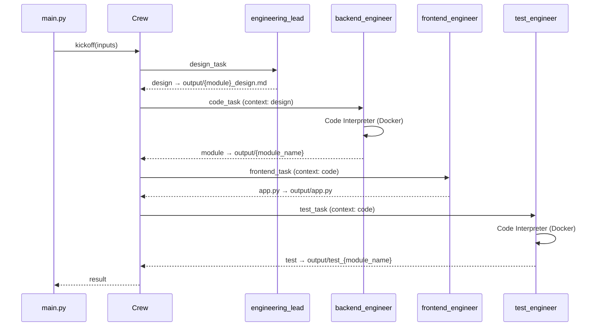

# Engineering Team — Developers Guide

Step-by-step guide to understand and extend the AI Crew Engineering Team. This crew turns high-level requirements into a design document, backend module, Gradio UI, and unit tests.

**Reference structure:** [CrewAI Implementation Guide](https://github.com/aditya-caltechie/ai-crew-stock-picker/blob/main/docs/developers_guide.md)

---

## Implementation Order

When building or modifying this crew, follow this order:

```
1. agents.yaml     → Define who (4 agents)
2. tasks.yaml      → Define what (4 tasks + context chain)
3. crew.py         → Wire agents, tasks, code execution
4. main.py         → Provide inputs and trigger kickoff
```

---

## Flow Diagram

```mermaid
flowchart LR
    subgraph Step1["Step 1: agents.yaml"]
        A1[engineering_lead]
        A2[backend_engineer]
        A3[frontend_engineer]
        A4[test_engineer]
    end

    subgraph Step2["Step 2: tasks.yaml"]
        T1[design_task]
        T2[code_task]
        T3[frontend_task]
        T4[test_task]
    end

    subgraph Step3["Step 3: crew.py"]
        C1[Agent methods]
        C2[Task methods]
        C3[Crew: sequential]
    end

    subgraph Step4["Step 4: main.py"]
        M1[requirements, module_name, class_name]
        M2[kickoff]
    end

    Step1 --> Step2 --> Step3 --> Step4
```



---

## Step-by-Step Guide

### Step 1: Define Agents (`config/agents.yaml`)

**Purpose:** Define each agent's role, goal, backstory, and LLM. This project has four agents.

| Field | What it does |
|-------|--------------|
| `role` | Who the agent is (e.g. "Engineering Lead", "Python Engineer") |
| `goal` | What they aim to achieve; can use `{requirements}`, `{module_name}`, `{class_name}` |
| `backstory` | Context that shapes behavior |
| `llm` | Model to use (e.g. `gpt-4o`, `openai/gpt-4o-mini`) |

**Placeholders:** Filled from `inputs` in `main.py`:
- `{requirements}` — Natural language system description
- `{module_name}` — Target Python module (e.g. `accounts.py`)
- `{class_name}` — Main class in that module (e.g. `Account`)

**Project agents:**

| Agent | Role | LLM | Code execution |
|-------|------|-----|----------------|
| `engineering_lead` | Produces design doc in Markdown | gpt-4o | No |
| `backend_engineer` | Implements the backend module | openai/gpt-4o-mini | Yes (Docker) |
| `frontend_engineer` | Writes Gradio `app.py` | openai/gpt-4o-mini | No |
| `test_engineer` | Writes unit tests | openai/gpt-4o-mini | Yes (Docker) |

**Note:** `backend_engineer` and `test_engineer` goals remind agents to pass `libraries_used` when using the Code Interpreter tool.

---

### Step 2: Define Tasks (`config/tasks.yaml`)

**Purpose:** Define tasks, which agent runs them, the context chain, and where output is saved.

| Field | What it does |
|-------|--------------|
| `description` | What the task does; can use `{requirements}`, `{module_name}`, `{class_name}` |
| `expected_output` | Format of the result (e.g. raw Python, no markdown) |
| `agent` | Agent from `agents.yaml` |
| `context` | Task(s) whose outputs this task receives |
| `output_file` | Path under `output/` where result is written |

**Context chain for this project:**

```yaml
design_task:
  agent: engineering_lead
  output_file: output/{module_name}_design.md
  # No context = first task

code_task:
  agent: backend_engineer
  context: [design_task]
  output_file: output/{module_name}

frontend_task:
  agent: frontend_engineer
  context: [code_task]
  output_file: output/app.py

test_task:
  agent: test_engineer
  context: [code_task]
  output_file: output/test_{module_name}
```

**Important:** `expected_output` for code tasks instructs agents to output raw Python only (no markdown, code blocks, or backticks).

---

### Step 3: Define Crew (`crew.py`)

**Purpose:** Map YAML config into CrewAI objects and set process type and code execution.

#### 3a. Agent methods

Each `@agent` method returns an `Agent` with config from `agents.yaml`. For agents that run code:

- `allow_code_execution=True`
- `code_execution_mode="safe"` (Docker)
- `max_execution_time=500`
- `max_retry_limit=3`

```python
@agent
def backend_engineer(self) -> Agent:
    return Agent(
        config=self.agents_config['backend_engineer'],
        verbose=True,
        allow_code_execution=True,
        code_execution_mode="safe",
        max_execution_time=500,
        max_retry_limit=3,
    )
```

#### 3b. Task methods

Each `@task` method returns a `Task` with config from `tasks.yaml` (no extra logic needed here).

#### 3c. Crew assembly

The crew uses `Process.sequential` — tasks run in YAML order: design → code → frontend → test.

```python
@crew
def crew(self) -> Crew:
    return Crew(
        agents=self.agents,
        tasks=self.tasks,
        process=Process.sequential,
        verbose=True,
    )
```

---

### Step 4: Entry Point (`main.py`)

**Purpose:** Define inputs and run the crew.

1. **Docker fix (macOS):** Sets `DOCKER_HOST` for Docker Desktop.
2. **Output dir:** Creates `output/` if missing.
3. **Inputs:** Build the `inputs` dict:
   - `requirements` — Natural language spec (default: account/trading system)
   - `module_name` — e.g. `"accounts.py"`
   - `class_name` — e.g. `"Account"`
4. **Kickoff:** `EngineeringTeam().crew().kickoff(inputs=inputs)`.

To change what the crew builds, edit `requirements`, `module_name`, and `class_name` in `main.py`.

---

## Sequence Diagram: Full Flow



---

## Key Concepts

### Process Type

This crew uses **`Process.sequential`**. Tasks run in fixed order; no manager or delegation.

### Code Execution

| Agent | Code execution | Use |
|-------|----------------|-----|
| `engineering_lead` | No | Produces design only |
| `backend_engineer` | Yes (Docker) | Implements backend module |
| `frontend_engineer` | No | Writes Gradio UI code |
| `test_engineer` | Yes (Docker) | Runs tests via Code Interpreter |

### Context Chain

```
design_task (no context)     → output/{module_name}_design.md
code_task (context: design)  → output/{module_name}
frontend_task (context: code) → output/app.py
test_task (context: code)    → output/test_{module_name}
```

### Output Layout

All generated files live under `output/` so the backend, app, and tests can be run in the same directory:

```
output/
├── {module_name}_design.md   # Design doc
├── {module_name}             # Backend (e.g. accounts.py)
├── app.py                    # Gradio UI
└── test_{module_name}        # Unit tests (e.g. test_accounts.py)
```

---

## Quick Reference: File Responsibilities

| File | Contains |
|------|----------|
| `config/agents.yaml` | 4 agent definitions (role, goal, backstory, llm) |
| `config/tasks.yaml` | 4 task definitions + context chain + output_file |
| `crew.py` | Agent methods, task methods, Crew (sequential) |
| `tools/custom_tool.py` | Example custom tool (optional; not used by default) |
| `main.py` | requirements, module_name, class_name, kickoff |

---

## Development Checklist

Use this when modifying or extending the crew:

- [ ] **1. agents.yaml** — Ensure role, goal, backstory, llm per agent; placeholders `{requirements}`, `{module_name}`, `{class_name}`
- [ ] **2. tasks.yaml** — Check description, expected_output, agent, context, output_file
- [ ] **3. crew.py** — Agent methods match agents.yaml; code execution only for backend/test
- [ ] **4. main.py** — Update requirements, module_name, class_name for your use case
- [ ] **5. Docker** — Required for backend and test agents; verify Docker Desktop (or equivalent) is running on macOS

---

## Adding a New Feature (Examples)

### Change the built system (different requirements)

1. Edit `requirements`, `module_name`, `class_name` in `main.py`.
2. Run the crew; agents use the new inputs.

### Add a new agent (e.g. security reviewer)

1. Add agent to `agents.yaml` (role, goal, backstory, llm).
2. Add task to `tasks.yaml` with `agent`, `context`, `output_file`.
3. Add `@agent` and `@task` methods in `crew.py`.
4. Ensure task order in `tasks.yaml` and `self.tasks` matches the desired flow.

### Switch LLM provider (e.g. Groq)

1. In `agents.yaml`, change `llm` (e.g. `groq/llama-3.3-70b-versatile`).
2. Add provider API key to `.env` and configure CrewAI for that provider.

### Add a custom tool to an agent

1. Create or edit a tool in `tools/` (extend `BaseTool`, define `name`, `description`, `args_schema`, `_run`).
2. In `crew.py`, pass `tools=[MyCustomTool()]` to the relevant `Agent(...)`.

---

## Run the Crew

```bash
cd src/engineering_team
crewai install
crewai run
```

Or with uv:

```bash
cd src/engineering_team
uv sync && uv run engineering_team
```

Ensure `.env` has required API keys (e.g. `OPENAI_API_KEY`). See [architecture.md](./architecture.md) for full run instructions.
